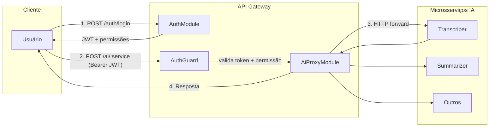
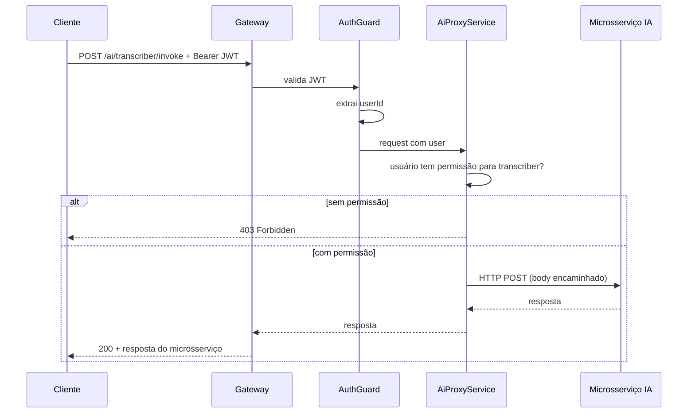

# Plano: Transformação em API Gateway Orquestrador de IA

## Arquitetura proposta



## Premissas de design

- **Autenticação**: Login retorna JWT; chamadas à IA exigem `Authorization: Bearer <token>`
- **Permissões**: Relação User-Service (cada usuário tem lista de serviços permitidos)
- **Microsserviços**: Adapter por serviço (URL e formato podem variar entre serviços)

---

## 1. Extensão do schema Prisma

Novos modelos em `prisma/schema.prisma`:

```prisma
model AiService {
  id          String   @id @default(uuid())
  slug        String   @unique   // ex: "transcriber", "summarizer"
  name        String
  baseUrl     String   // URL base do microsserviço (ou vindo de .env)
  createdAt   DateTime @default(now())
  users       UserAiService[]
}

model UserAiService {
  userId    String
  serviceId String
  user      User      @relation(fields: [userId], references: [id], onDelete: Cascade)
  service   AiService @relation(fields: [serviceId], references: [id], onDelete: Cascade)
  @@id([userId, serviceId])
}
```

Atualizar `User` com relação `services UserAiService[]`.

---

## 2. Módulo de autenticação (AuthModule)

**Pasta:** `src/modules/auth/`

- **AuthController**
  - `POST /auth/login` — body: `{ login, password }`
  - Retorna `{ accessToken, expiresIn, user: { id, email, login, services: [...] } }`
- **AuthService**
  - Valida login/senha (bcrypt.compare)
  - Gera JWT com payload `{ sub: userId, login }`
  - Inclui lista de slugs de serviços permitidos na resposta (para uso no cliente)
- **AuthGuard**
  - Valida JWT no header
  - Extrai usuário e anexa a `request.user`
  - Usado nas rotas protegidas
- **Dependência:** `@nestjs/jwt` e `@nestjs/passport` + `passport-jwt`

**Configuração:** Adicionar `JWT_SECRET` e `JWT_EXPIRES_IN` em `src/config/app-config.ts`.

---

## 3. Módulo de proxy para IA (AiProxyModule)

**Pasta:** `src/modules/ai-proxy/`

- **AiProxyController**
  - Rotas protegidas pelo AuthGuard
  - `POST /ai/:serviceSlug/*` — repassa o body e query params para o microsserviço correspondente
  - Alternativa mais explícita: `POST /ai/:serviceSlug/invoke` com body padronizado
- **AiProxyService**
  - Valida se o usuário autenticado tem permissão para `serviceSlug` (consulta UserAiService)
  - Obtém baseUrl do serviço (model AiService ou config)
  - Usa HttpService (Axios via `@nestjs/axios`) para encaminhar a requisição
  - Retorna a resposta do microsserviço (ou trata erros e timeouts)
- **ServicePermissionGuard**
  - Guard específico que verifica se `request.user` tem acesso ao `:serviceSlug`
  - Retorna 403 se não tiver permissão

**Configuração:** URLs dos microsserviços via variáveis de ambiente (ex: `AI_TRANSCRIBER_URL`, `AI_SUMMARIZER_URL`) ou via tabela `AiService.baseUrl`, carregando de `.env` no bootstrap.

---

## 4. Fluxo de dados

1. **Login:**
   - `POST /auth/login` → valida credenciais → retorna JWT + lista de serviços permitidos.

2. **Chamada à IA:**
   - `POST /ai/transcriber/invoke` com body `{ ... }` e header `Authorization: Bearer <token>`
   - AuthGuard valida JWT e popula `request.user`
   - ServicePermissionGuard valida se o usuário pode usar `transcriber`
   - AiProxyService encaminha para o microsserviço e devolve a resposta

3. **Resposta:**
   - Pass-through da resposta do microsserviço; em caso de erro (4xx/5xx), o gateway pode normalizar a resposta ou repassar o status original.

---

## 5. Estrutura de pastas final

```
src/modules/
├── auth/
│   ├── auth.module.ts
│   ├── auth.controller.ts
│   ├── auth.service.ts
│   ├── guards/
│   │   └── jwt-auth.guard.ts
│   ├── strategies/
│   │   └── jwt.strategy.ts
│   └── dto/
│       ├── login.dto.ts
│       └── login-response.dto.ts
├── ai-proxy/
│   ├── ai-proxy.module.ts
│   ├── ai-proxy.controller.ts
│   ├── ai-proxy.service.ts
│   ├── guards/
│   │   └── service-permission.guard.ts
│   └── (adapters por serviço, se necessário)
└── user/           # mantido (CRUD admin, sem login público)
```

---

## 6. Novas dependências

| Pacote             | Uso                                     |
| ------------------ | --------------------------------------- |
| `@nestjs/jwt`      | Geração e validação de JWT              |
| `@nestjs/passport` | Integração com Passport                 |
| `passport-jwt`     | Estratégia JWT                          |
| `@nestjs/axios`    | Cliente HTTP para chamar microsserviços |
| `axios`            | Peer dependency do @nestjs/axios        |

---

## 7. Variáveis de ambiente

Adicionar em `.env.dev` / `.env.prod`:

```
JWT_SECRET=<segredo-forte>
JWT_EXPIRES_IN=7d
AI_TRANSCRIBER_URL=http://localhost:3001
AI_SUMMARIZER_URL=http://localhost:3002
# ... uma por microsserviço ou uso de AiService.baseUrl
```

---

## 8. Decisões em aberto (ajustar conforme necessidade)

- **Formato da rota de IA:**
  - Opção A: `POST /ai/:serviceSlug/invoke` com body único (o gateway monta a chamada interna)
  - Opção B: `POST /ai/:serviceSlug/*` com proxy transparente do path
- **Origem das URLs:**
  - Variáveis de ambiente (`AI_*_URL`)
  - Ou tabela `AiService` com `baseUrl` (flexível, mas exige seeds/migrations)
- **UserModule:**
  - Manter CRUD para gestão de usuários (admin); considerar proteger com guard de admin/role no futuro
  - Endpoint de signup (`POST /user`) pode ser público ou restrito
- **Resposta em erro:**
  - Repassar status e body do microsserviço
  - Ou padronizar (ex: sempre 502 com mensagem genérica em caso de falha do upstream)

---

## 9. Ordem de implementação sugerida

1. Migrations Prisma (AiService, UserAiService, relação em User)
2. AuthModule (login, JWT, guards)
3. Seed de AiService (ou config inicial)
4. AiProxyModule (controller, service, ServicePermissionGuard)
5. Ajustes em AppConfig e .env
6. Testes manuais com um microsserviço real

---

## Diagrama de sequência (chamada à IA)


